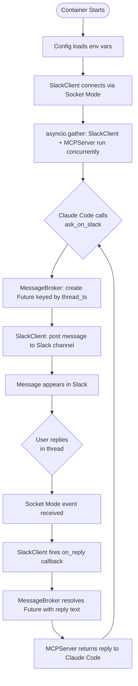
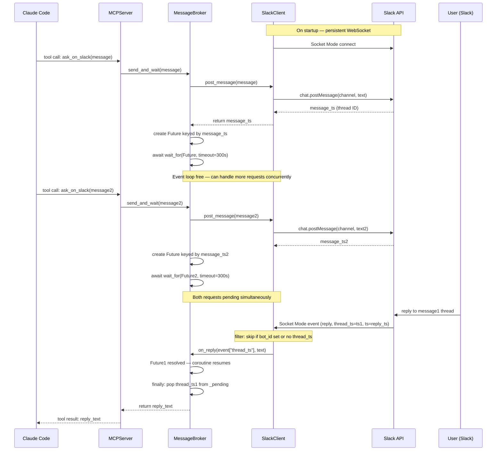

# Project Main Architecture — Claude ↔ Slack Two-Way Bridge

## Stack

| Layer | Technology | Purpose |
|---|---|---|
| MCP Server | FastMCP (Python) | Exposes tools to Claude Code |
| Slack Integration | slack_bolt + Socket Mode | Send & receive Slack messages |
| Async Runtime | asyncio | Concurrent waiting for Slack replies |
| Config | pydantic-settings | Env var loading & validation |
| Containerization | Docker | Isolated, portable deployment |

---

## Project Structure

```
claude-slack-two-way/
├── Dockerfile
├── docker-compose.yml
├── .env.example
├── requirements.txt
└── src/
    ├── main.py            # Entry point — wires all components and starts the app
    ├── config.py          # Config — loads and validates env vars
    ├── mcp_server.py      # MCPServer — FastMCP server, exposes ask_on_slack tool
    ├── slack_client.py    # SlackClient — wraps slack_bolt, sends & listens
    └── message_broker.py  # MessageBroker — bridges MCP ↔ Slack, manages pending replies
```

### Classes Overview

**`Config`**
- Loads env vars: `SLACK_BOT_TOKEN`, `SLACK_APP_TOKEN`, `SLACK_CHANNEL`
- Single source of truth for all settings

**`SlackClient`**
- Connects to Slack via Socket Mode using `AsyncApp` + `AsyncSocketModeHandler` (async slack_bolt API — required to share the event loop with FastMCP)
- Accepts an `on_reply(thread_ts, text)` callback at construction time
- `post_message(text: str) -> str` — posts a message, returns `response["ts"]` as thread timestamp
- `start() -> None` — `await handler.start_async()`
- Event handler filters out: bot self-echo (`event.get("bot_id")` is set) and top-level messages (`"thread_ts"` not in event)
- Uses `event["thread_ts"]` (not `event["ts"]`) to identify the parent thread when dispatching replies

**`MessageBroker`**
- Holds a dict of pending `asyncio.Future` objects keyed by thread timestamp
- `send_and_wait(message)` — posts via SlackClient, creates a Future, then `await asyncio.wait_for(future, timeout=300.0)` (yields to event loop — never blocks)
- On timeout raises `RuntimeError("No reply received within 5 minutes")`
- `try/finally` always pops the Future from `_pending` on completion, error, or timeout (stale Future cleanup)
- Multiple concurrent requests are all pending simultaneously in the same event loop
- `resolve(thread_ts, reply_text)` — called by SlackClient callback; resolves the matching Future, resuming the correct awaiting coroutine

**`MCPServer`**
- Does NOT own the `FastMCP` instance — receives it via `register(mcp: FastMCP)`
- `register(mcp)` — registers `ask_on_slack` as a tool on the provided `FastMCP` instance
- `ask_on_slack(message: str) -> str` — declared `async def` (required, since it awaits a Future)
- Delegates to MessageBroker and returns the reply to Claude Code

---

## Activity Flow



---

## Sequence Diagram



---

## Configuration

### Docker container (Slack credentials — shared, set once in `.env`)
```env
# --- Container-level vars: set in .env / docker-compose, shared across projects ---
SLACK_BOT_TOKEN=xoxb-...       # Bot OAuth token (post messages)
SLACK_APP_TOKEN=xapp-...       # App-level token (Socket Mode)

# --- Per-project var: do NOT put here — pass via MCP client config instead ---
# SLACK_CHANNEL is intentionally omitted; each project sets it in its own MCP config
```

### MCP client config (per project — set by the developer per project)
Each project passes `SLACK_CHANNEL` through its own MCP config (e.g. `.mcp.json` or `claude_desktop_config.json`):
```json
{
  "mcpServers": {
    "slack-bridge": {
      "command": "docker",
      "args": ["run", "claude-slack-bridge"],
      "env": {
        "SLACK_CHANNEL": "#vibki"
      }
    }
  }
}
```
This way the container is generic and reusable — the project decides which channel to target.

---

## Key Design Decisions

- **One container = one project = one channel** — no routing logic needed
- **Socket Mode** — no public URL or webhook required, works inside Docker
- **Shared asyncio event loop** — `AsyncApp` + `AsyncSocketModeHandler` (async slack_bolt) and FastMCP's async run method both run inside a single `asyncio.gather()` in `main.py`. This is critical: Slack events resolve Futures on the same loop that awaits them.
- **asyncio.Future + wait_for** — each request awaits its own Future with a 5-minute timeout; the event loop stays free to handle concurrent requests and Slack events
- **FastMCP instance owned by main.py** — created in `main.py`, passed into `MCPServer.register(mcp)`. MCPServer does not own it.
- **async tool** — `ask_on_slack` is `async def` because it awaits a Future
- **Bot self-echo filter + thread_ts guard** — Slack echoes the bot's own messages; the event handler skips them. It also skips top-level messages (no `thread_ts`), and always reads `event["thread_ts"]` (not `event["ts"]`) to key Future lookups.
- **No FastAPI** — FastMCP handles the MCP transport; no HTTP server needed
- **Thin classes** — each class has one responsibility, easy to test or swap out
